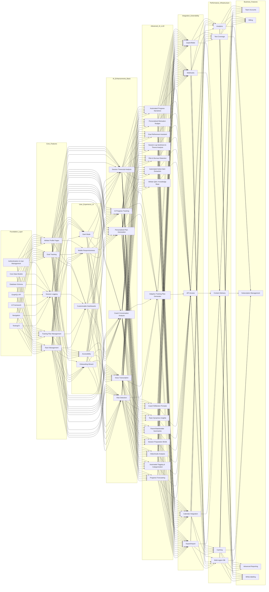

```mermaid
flowchart LR
    subgraph Foundation_Layer
        F1[Authentication & User Management]
        F2[Core Data Models]
        F3[Database Schema]
        F4[GraphQL API]
        F5[UI Framework]
        F6[Navigation]
        F7[Testing/CI]
    end

    subgraph Core_Features
        C1[Athlete Profile Pages]
        C2[Goal Tracking]
        C3[Session Logging]
        C4[Training Plan Management]
        C5[Team Management]
    end

    subgraph User_Experience_UI
        U1[Dark Mode]
        U2[Mobile Responsiveness]
        U3[Customizable Dashboards]
        U4[Accessibility]
        U5[Onboarding Wizard]
    end

    subgraph AI_Enhancements_Basic
        A1[Session Transcript Analysis]
        A2[AI Progress Tracking]
        A3[Personalized Plan Generation]
        A4[Coach Conversation Analysis]
        A5[Voice Transcription]
        A6[Risk Detection]
    end

    subgraph Advanced_AI_LLM
        L1[Automated Progress Narratives]
        L2[Personalized Motivation Nudges]
        L3[Goal Refinement Assistant]
        L4[Session Log Sentiment & Theme Analysis]
        L5[Risk & Burnout Detection]
        L6[Automated Action Item Extraction]
        L7[Athlete Q&A / Knowledge Base]
        L8[Adaptive Training Plan Generator]
        L9[Coach Reflection Prompts]
        L10[Team Dynamics Insights]
        L11[Parent/Stakeholder Summaries]
        L12[Session Preparation Briefs]
        L13[Video/Audio Analysis]
        L14[Automated Tagging & Categorization]
        L15[Progress Forecasting]
    end

    subgraph Integration_Extensibility
        I1[Zapier/Make]
        I2[Webhooks]
        I3[API Access]
        I4[Calendar Integration]
        I5[Export/Import]
    end

    subgraph Performance_Infrastructure
        P1[Analytics]
        P2[Test Coverage]
        P3[Content Delivery]
        P4[Caching]
        P5[Multi-region DB]
    end

    subgraph Business_Features
        B1[Team Accounts]
        B2[Billing]
        B3[Subscription Management]
        B4[Advanced Reporting]
        B5[White-labeling]
    end

    %% Dependencies
    F1 & F2 & F3 & F4 & F5 & F6 & F7 --> C1 & C2 & C3 & C4 & C5
    C1 & C2 & C3 & C4 & C5 --> U1 & U2 & U3 & U4 & U5
    C1 & C2 & C3 & C4 & C5 --> A1 & A2 & A3 & A4 & A5 & A6
    U1 & U2 & U3 & U4 & U5 --> A1 & A2 & A3 & A4 & A5 & A6
    A1 & A2 & A3 & A4 & A5 & A6 --> L1 & L2 & L3 & L4 & L5 & L6 & L7 & L8 & L9 & L10 & L11 & L12 & L13 & L14 & L15
    L1 & L2 & L3 & L4 & L5 & L6 & L7 & L8 & L9 & L10 & L11 & L12 & L13 & L14 & L15 --> I1 & I2 & I3 & I4 & I5
    I1 & I2 & I3 & I4 & I5 --> P1 & P2 & P3 & P4 & P5
    P1 & P2 & P3 & P4 & P5 --> B1 & B2 & B3 & B4 & B5
```